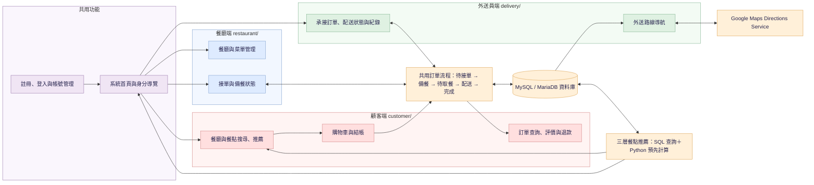

# NoshNow｜智慧外送平台課程原型

NoshNow 是「資料庫管理」課程的三人小組專題，展示顧客點餐、餐廳接單、外送員配送，以及同一筆訂單在三種角色間的資料銜接。本儲存庫將課程成果整理為便於閱讀與展示的版本。

原專題中，我擔任組長，主責顧客端、參與部分外送員端功能、資料庫與三方流程整合，並負責三層餐點推薦及參與外送路線規劃。餐廳端主要管理功能由其他組員開發。

## 系統架構



此圖概括三種角色共用同一套訂單與資料庫的關係；訂單狀態及各項功能細節以程式與下文說明為準。推薦結果會回到顧客頁面，路線則由外送員端向 Google Maps 服務請求。

## 功能與檔案位置

| 功能 | 主要檔案 |
| --- | --- |
| 帳號註冊、登入與管理 | `register.php`、`register_process.php`、`login.php`、`account_manage.php` |
| 顧客瀏覽、搜尋與隨機餐點 | `index.php`、`customer/browse_restaurant.php`、`customer/restaurant_menu.php`、`customer/menu_item_details.php`、`customer/lottery.php` |
| 購物車與結帳 | `customer/add_to_cart.php`、`customer/cart.php`、`customer/get_cart_count.php`、`customer/get_cart_items.php`、`customer/checkout.php`、`customer/process_checkout.php` |
| 訂單查詢、評論與退款 | `customer/customer_order_info.php`、`customer/submit_review.php`、`customer/refund_application.php`、`customer/submit_refund.php` |
| 餐廳端管理 | `restaurant/` |
| 外送員端接單、狀態、紀錄與導航 | `delivery/` |
| 三層餐點推薦 | `index.php`、`customer/browse_restaurant.php`、`customer/recommendation.php`、`scripts/recommendations/` |
| Schema、匿名展示資料與測試資料產生 | `database/`、`scripts/data_generation/` |
| 共用設定、驗證與畫面資源 | `config/`、`includes/`、`components/`、`assets/` |

共用首頁及帳號頁面位於根目錄；顧客、餐廳與外送員專用頁面分別放在 `customer/`、`restaurant/` 與 `delivery/`。設定、資料庫、推薦與測試資料程式、共用元件和靜態資源另依用途分開放置。

## 三層餐點推薦

1. 首頁 Top 10：以 SQL 即時計算各餐點銷售數量，不寫入推薦表。
2. 分類偏好加權推薦：`scripts/recommendations/weighted_category.py` 依使用者分類下單次數與餐點人氣計算分數，取前五名寫入 `weighted_recommendation`，供餐點搜尋頁使用。
3. Item-Based Collaborative Filtering：`scripts/recommendations/item_based_collaborative_filtering.py` 將整筆訂單的評分對應到該訂單的餐點，使用 Surprise 的 KNNBasic 與 cosine similarity 預測分數，取前五名寫入 `recommendation`，供「專屬美食週報」使用。沒有個人推薦結果時，頁面改顯示熱門餐點。

第三層使用的是「整筆訂單評分」，不是個別餐點評分；本課程專題也沒有進行離線準確率評估或使用者測試，因此不能據此聲稱推薦效果已獲驗證。

## 外送路線規劃

`delivery/delivery_navigation.php` 讀取外送員承接的訂單、餐廳與顧客座標，使用 Google Maps JavaScript API 的 Directions Service 並設定 `optimizeWaypoints`，呈現建議路線、停靠順序和訂單資訊。相同餐廳的取餐點只加入一次；瀏覽器定位更新時會重新請求路線。

路線排序由 Google Maps 提供，不是本組自行開發的最佳化演算法。此原型**尚未強制同一筆訂單必須先取餐、後送餐**，也受途經點數量與地圖服務配額限制，不能直接用於正式派送。

## 本機執行

建議在本機開發環境使用 PHP 8.2、MySQL／MariaDB 和 Python 3.11。頁面使用 Bootstrap CDN；地圖功能需自行設定 Google Maps JavaScript API 金鑰。

1. 在**空白的本機資料庫環境**匯入 `database/schema.sql`，再匯入 `database/seed.sql`。Schema 會建立名為 `noshnow` 的資料庫與資料表，不會刪除既有資料表；若同名資料表已存在，請另用乾淨資料庫環境測試，避免把示範資料混入私人資料。
2. 複製 `config/local.example.php` 為 `config/local.php`，填入自己的資料庫連線資訊。`config/local.php` 已列入 `.gitignore`，不要上傳。也可以直接使用 `NOSHNOW_DB_*` 與 `GOOGLE_MAPS_API_KEY` 環境變數；PHP **不會自動讀取** `.env` 檔。
3. 從專案根目錄啟動 PHP 內建伺服器，例如 `php -S 127.0.0.1:8000`，再開啟 `http://127.0.0.1:8000/login.php`。
4. 如需重新計算第二、三層推薦，先依 `requirements.txt` 安裝 Python 套件、設定 `NOSHNOW_DB_*` 環境變數，再執行以下程式。`scikit-surprise` 在部分新版 Python 上可能需要額外的編譯環境，因此建議使用 Python 3.11。

```bash
python scripts/recommendations/weighted_category.py
python scripts/recommendations/item_based_collaborative_filtering.py
```

匯入展示資料後，可用以下**匿名測試帳號**登入；三者密碼皆為 `Demo123!`：

| 身分 | 帳號 |
| --- | --- |
| 顧客 | `demo_customer` |
| 餐廳業者 | `demo_restaurant` |
| 外送員 | `demo_delivery` |

若需更多測試資料，可執行 `python scripts/data_generation/generate_test_data.py`。程式預設只新增合成資料；`--replace` 會刪除先前由此程式建立的 `generated_` 帳號及其關聯資料，請只在獨立測試資料庫使用。

## 版本整理說明

本儲存庫延續課程專題的核心設計與主要功能，包括顧客、餐廳及外送員三方流程、三層餐點推薦與外送路線規劃。為方便閱讀、展示與本機試用，我重新整理檔案結構與設定方式，改用虛構示範資料，並修正部分頁面及資料流程的細節。
